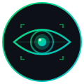
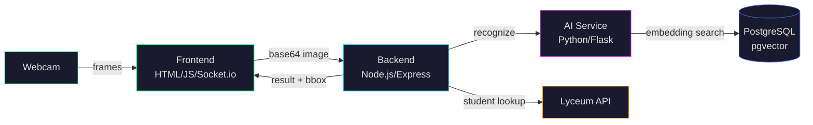

<p align="center">
  
</p>

<h1 align="center">VECTOR-IA - Computer Vision Processing</h1>
<p align="center"><i>Facial Recognition Attendance System</i></p>

<p align="center">
  <a href="#"></a>
  <a href="#"></a>
  <a href="#"></a>
  <a href="#"></a>
</p>

<p align="center">
  <a href="#"></a>
  <a href="#"></a>
  <a href="#"></a>
  <a href="#"></a>
</p>

<p align="center">
  <b>Real-time facial recognition system for automated student attendance tracking.</b><br>
  <sub>Built with microservices architecture using AI-powered face embeddings and vector similarity search.</sub>
</p>

---

## Overview

**Vector-IA** captures live webcam frames, detects faces using deep learning, and matches them against a database of student facial embeddings stored in PostgreSQL with pgvector. When a match is found with high confidence, the system automatically records attendance and displays the student's information in real-time.

<br>

## Architecture



<br>

### Services

| Service | Technology | Port | Description |
|:--------|:-----------|:----:|:------------|
| **`web-app`** | HTML5, JavaScript, Socket.io | `8080` | Camera capture terminal with real-time face overlay |
| **`backend-node`** | Node.js, Express, Socket.io | `3000` | Orchestration server connecting all services |
| **`ai-service`** | Python, Flask, face_recognition | `5000` | Face detection, encoding & vector similarity search |
| **`db`** | PostgreSQL + pgvector | `5432` | Stores student data and 128-dim facial embeddings |

<br>

## How It Works

```
  Frame Capture          Recognition Pipeline              Response
 ┌─────────────┐    ┌──────────────────────────┐    ┌─────────────────┐
 │  Webcam      │    │  1. Face Detection       │    │  Student Name   │
 │  captures    │───▶│  2. Extract 128-dim      │───▶│  Course Info    │
 │  every 2s    │    │     embedding vector     │    │  Bounding Box   │
 │              │    │  3. pgvector similarity   │    │  Confidence %   │
 └─────────────┘    │  4. Confidence > 60%?     │    └─────────────────┘
                     └──────────────────────────┘
```

1. **Capture** — Frontend grabs webcam frames every 2 seconds via WebRTC
2. **Detect** — AI service locates faces and extracts 128-dimensional embeddings
3. **Match** — pgvector finds the closest embedding using cosine distance
4. **Verify** — Backend validates the student via Lyceum API if confidence > 60%
5. **Display** — Frontend shows student info with a green bounding box overlay

<br>

## Quick Start

### Prerequisites

<p>
  
  
</p>

### Installation

```bash
# Clone the repository
git clone https://github.com/your-username/vector-ia.git
cd vector-ia

# Build and start all services
docker compose up --build

# Open the attendance terminal
open http://localhost:8080
```

> **Note:** First build may take several minutes due to `dlib` and `face_recognition` compilation.

<br>

## API Reference

### `POST /recognize`

Detect and recognize a face from a base64-encoded image.

```json
// Request
{ "image": "data:image/jpeg;base64,/9j/4AAQ..." }

// Response (200)
{
  "matricula": "12345",
  "confidence": 0.92,
  "box": { "top": 80, "right": 300, "bottom": 280, "left": 120 }
}
```

### `POST /cadastrar`

Register a new student with their facial embedding.

```bash
curl -X POST http://localhost:5000/cadastrar \
  -H "Content-Type: application/json" \
  -d '{
    "matricula": "12345",
    "nome": "John Doe",
    "image": "<base64-image>"
  }'
```

```json
// Response (201)
{ "message": "Student John Doe (ID: 12345) registered successfully!" }
```

<br>

## Project Structure

```
vector-ia/
├── docker-compose.yaml          # Service orchestration
├── init-db/
│   └── init.sql                 # Database schema with pgvector
├── ai-service/
│   ├── Dockerfile
│   ├── requirements.txt
│   └── app.py                   # Face recognition & embedding service
├── backend-node/
│   ├── Dockerfile
│   ├── package.json
│   └── src/
│       ├── server.js            # WebSocket orchestration server
│       └── lyceum.js            # Lyceum API integration
└── web-app/
    ├── Dockerfile
    └── src/
        └── index.html           # Real-time camera capture terminal
```

<br>

## Tech Stack

<table>
  <tr>
    <td align="center" width="140">
      <br>
      <b>Python</b><br>
      <sub>AI Service</sub>
    </td>
    <td align="center" width="140">
      <br>
      <b>Node.js</b><br>
      <sub>Backend</sub>
    </td>
    <td align="center" width="140">
      <br>
      <b>PostgreSQL</b><br>
      <sub>pgvector</sub>
    </td>
    <td align="center" width="140">
      <br>
      <b>Docker</b><br>
      <sub>Containers</sub>
    </td>
    <td align="center" width="140">
      <br>
      <b>Socket.io</b><br>
      <sub>Real-time</sub>
    </td>
    <td align="center" width="140">
      <br>
      <b>OpenCV</b><br>
      <sub>Vision</sub>
    </td>
  </tr>
</table>

<br>

## Key Features

- **Real-time Recognition** — Continuous face detection with live bounding box overlay
- **Vector Similarity Search** — 128-dimensional face embeddings with pgvector cosine distance
- **Microservices Architecture** — Each service runs in its own Docker container
- **WebSocket Communication** — Low-latency frame streaming via Socket.io
- **Upsert Registration** — Re-registering a student updates their face embedding
- **Multi-Camera Support** — Select from available cameras in the browser

<br>

---

<p align="center">
  <sub>Built with computer vision and vector databases</sub><br>
  <a href="#"></a>
  <a href="#"></a>
  <a href="#"></a>
</p>
